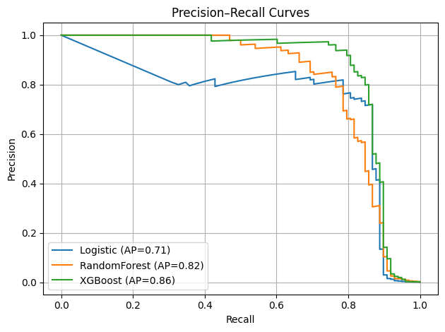
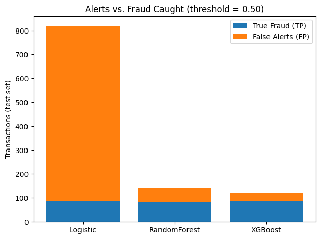

# Fraud Detection Model Training and Evaluation

**Installation/Setup Instructions**: Clone the repository, create a virtual environment, and run pip install -r requirements.txt. Run the Jupyter Notebook notebook/identify_credit_card_fraud.ipynb to see the analysis and model training.

As digital transactions become instantaneous and global, the challenge of identifying fraud grows in scale and complexity. Traditional, rule-based systems (e.g., "flag any transaction over $10,000 from a new location") are no longer sufficient. They are too rigid to adapt to the creative tactics of modern fraudsters.

## The Fraud Detection Dilemma

Every fraud detection system faces a fundamental dilemma. You can either use a model that is:

-   **Overly Cautious**: Catch more fraud, but overwhelm analysts and frustrate customers with too many false alarms 
-   **Overly Trusting**: Minimize customer friction, but miss more real fraud and suffer greater financial loss.

The key to implementing a successful fraud identification system is to catch as much fraud as possible while also minimizing the false positives that impact your customers and your fraud analysts.

## Defining Success: Choosing the Right Evaluation Metric

So what does 'good' look like when evaluating fraud detection models? It might seem intuitive to say that the accuracy of the model prediction is the most important metric; however, this is a dangerous trap when you're looking for something that happens as rarely as fraud.

Consider a dataset with 100,000 transactions, where only 100 are fraudulent (0.1%). A lazy model that predicts "not fraud" every single time would be 99.9% accurate, but it would be completely useless because it catches zero fraud.

This is where trade-offs begin to materialize. There are four ways we can evaluate the determinations made by the fraud detection system.

-   **True Positive (TP)**: The model correctly flagged a fraudulent transaction. This is a win.
-   **True Negative (TN)**: The model correctly ignored a legitimate transaction. This is a silent win.
-   **False Positive (FP)**: The model flagged a legitimate transaction as fraud. This is the "customer friction" cost.
-   **False Negative (FN)**: The model missed a fraudulent transaction. This is the "direct financial loss" cost.

There are two metrics that focus on these trade-offs when the model makes incorrect fraud determinations:

-   **Precision (The "Analyst Workload" Metric)**: Of all the alerts the model generated, what percentage were actually fraudulent?
-   **Recall (The "Catch Rate" Metric)**: Of all the actual fraudulent transactions that occurred, what percentage did our model catch?

Because a detection system must balance fraud analyst capacity (precision) with loss avoidance (recall), we should track both simultaneously. Improving one often hurts the other, so we need a lens that shows the whole trade-off.

We do this by plotting the precision-recall curve to see how much recall (how much fraud did we catch?) changes as we change the precision (how many transactions were flagged as suspicious?) and measuring the area under the curve, called the **PR-AUC**. A higher value means the model can deliver higher precision and recall at the same time.

## Models

The models we're going to evaluate range from relatively simple to complex machine learning models. The accompanying Jupyter Notebook walks through the process of training and testing these models on a sample credit card transaction dataset. Here, we'll focus on interpretation of the results.

## Results

Once we've trained and tested the models, we need to evaluate the results.

| Model | PR-AUC | Precision | Recall |
| :--- | :--- | :--- | :--- |
| Logistic | 0.7133 | 0.1076 | 0.8980 |
| RandomForest | 0.8162 | 0.5704 | 0.8265 |
| XGBoost | 0.8630 | 0.6967 | 0.8673 |

XGBoost is the clear winner on the ranking metric (PR-AUC = 0.8630) and will deliver us the most efficient fraud detection system, but let's investigate a little more to see what the trade-offs look like for our data.

### Logistic Regression
The model had a very high recall at **89.8%**, identifying almost 9 out of 10 fraudulent transactions in the dataset. The downside of catching that much fraud, with a precision score of **10.8%**, is that for every 100 flagged transactions, almost 90 of them will be false positives.

### RandomForest
This model identifies less of the actual fraud (**82.7%** of the fraud cases) but dramatically increased the precision, jumping to **57%**. This means using this model instead of the Logistic Regression reduces the number of legitimate transactions the analyst team has to work through.

### XGBoost
At **86.7%** recall, this model catches more fraud than the Random Forest model and is close to the performance of the over-eager Logistic Regression model. To show this model is the best of both worlds, it returns the highest precision score of any model at **69.7%**, creating the fewest false alarms of the three.

## Bottom Line

The **Logistic Regression** model is a heavy-handed model that casts a wide net to identify fraud, creating mountains of alerts to work through. 

The **Random Forest** model provides a solid, balanced performance and represents a massive improvement over the regression model by reducing the number of false positives. 

The **XGBoost** model emerges as the clear winner. It strikes the best balance, achieving a high recall (86.7%) that is competitive with the over-eager Logistic Regression model, while delivering the highest precision (69.7%) by a wide margin. This means it prevents significant fraud loss while creating the most manageable workload for the fraud analysis team, making it the most operationally efficient choice.

## Supporting Charts

### Precision-Recall Curve
This chart shows our main metric for success, the precision-recall curve, and how well each model performs as you move through the precision and recall scores. XGBoost stays high and to the right for the longest, showing the precision stays high as the recall value increases throughout the chart.

### Alerts vs. Fraud Caught
To show the business impact of the model choices, we can plot all of the fraud alerts identified by each model and highlight the actual fraud vs. the false alerts. I'm sure the fraud analysis team would be most interested in this chart since the orange bar shows how many fraud alerts they will have to spend analyzing legitimate transactions.  

### Step 6: Next Steps and Production Considerations

With the XGBoost model selected as our champion, the next phase is to prepare it for a real-world production environment. This involves several key steps:

1.  **Threshold Tuning for Business Needs:**
    The model currently uses a default probability threshold of 0.5 to classify transactions. This is rarely optimal. We need to select a threshold that balances the trade-off between **precision** and **recall** based on business goals.

2.  **Model Deployment as a REST API:**
    To provide real-time predictions, the model should be deployed as a microservice. This is created with a REST API, like **FastAPI** or **Flask** that:
        *   Accepts new transaction data as a JSON payload.
        *   Preprocesses the data.
        *   Feeds the data to the XGBoost model to get a fraud probability.
        *   Returns the prediction (fraud/legit) based on our tuned threshold.

3.  **Monitoring and Maintenance (MLOps):**
    Once deployed, a model's performance can degrade over time as transaction and fraud patterns evolve. We could implement a monitoring strategy to track:
        *   **Concept Drift:** Is the model's predictive power (PR-AUC) decreasing on new data?
        *   **Data Drift:** Are the statistical properties of incoming transaction data changing significantly from the training data?
        *   **Retraining Strategy:** Establish a plan to periodically retrain the model on new data or trigger retraining automatically when performance drops below a set benchmark.

## About the Data

This data comes from Kaggle's Credit Card Fraud Detection dataset: [https://www.kaggle.com/datasets/mlg-ulb/creditcardfraud/data](https://www.kaggle.com/datasets/mlg-ulb/creditcardfraud/data).

It contains:
-   `Time` and `Amount` data
-   A `Class` field to identify fraudulent transactions
-   28 other columns that contain anonymized features of credit card transaction data.

The data was anonymized using a Principal Component Analysis (PCA) transformation. This process obscures the underlying data but maintains the statistical relationships. While you won't recognize fields and values that you might think of for a credit card transaction dataset, like vendor category and location, the resulting values show the same relationships as the original dataset.

